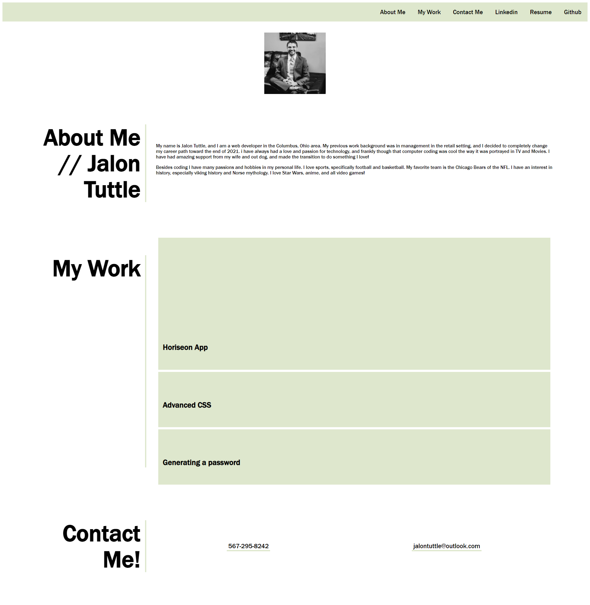

# Professional-Portfolio 
## Description
- Motivation for this project was to create a professional looking portfolio that could potentially be used for future job search.
- I built this project with full intentions to be able to update and be able to use at a later time for career development.
- This solves the problem of being able to have a source to show employers the work I have accomplished in the past.
- I learned a lot about flexbox, and how to style them as such. It was challenging as these are mostly new concepts for me.
## Usage
The following is a working screenshot of my final updated webpage.
    
    ```

